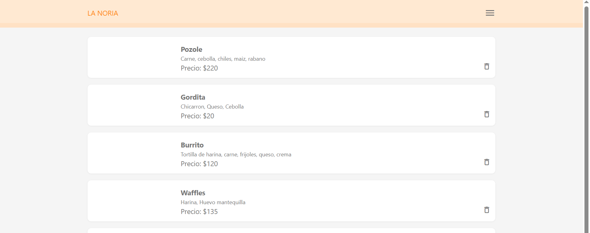
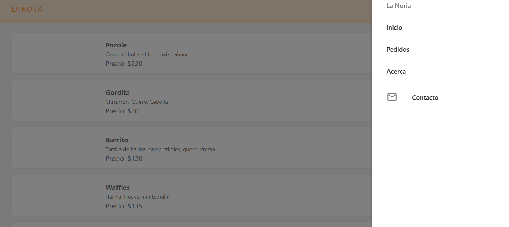
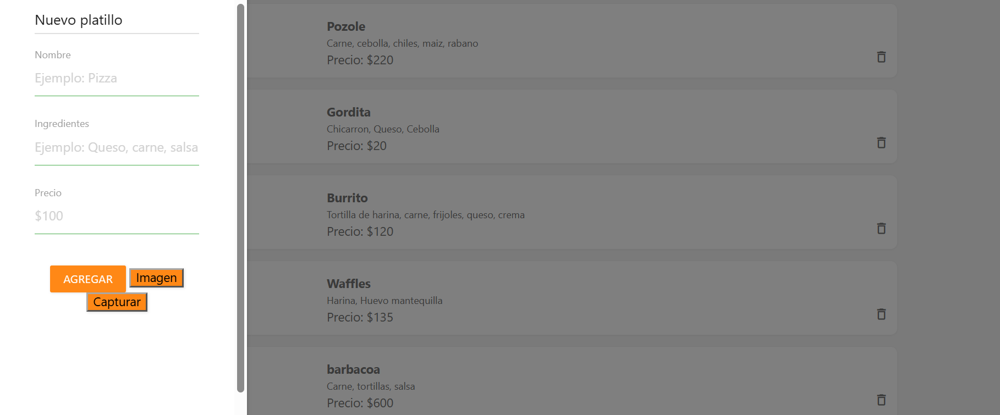

# La Noria 

## 1. Título del proyecto

**Nombre del proyecto:** La Noria

**Tipo de aplicación:** PWA (Progressive Web App)

**Descripción breve:**
La Noria es una aplicación web progresiva para consultar platillos y realizar pedidos de comida de manera sencilla, rápida y accesible desde diferentes dispositivos.

**Materia:** Taller de Programación Avanzada
**Carrera:** Sistemas Computacionales
**Alumno:** Gael Cárdenas Márquez
**Grupo:** 09ISC181
**Institución:** Universidad Multicultural Cudec

## 2. Descripción del proyecto

**La Noria** es una aplicación de comida desarrollada como una PWA, cuyo propósito es facilitar a los usuarios la consulta de platillos y la realización de pedidos desde un dispositivo como computadora, celular o tablet.

La aplicación busca resolver la necesidad de contar con una forma sencilla y organizada para consultar los alimentos disponibles y realizar un pedido sin necesidad de acudir directamente al establecimiento.

### Usuarios

La aplicación está dirigida principalmente a:

* Personas que desean consultar el menú de comida.
* Clientes que desean realizar pedidos.
* Personal encargado de administrar los platillos.
* Usuarios que necesitan consultar información y datos de contacto del negocio.

### Propósito

El propósito principal de La Noria es ofrecer una plataforma sencilla para gestionar y consultar productos de comida, permitiendo al usuario navegar por la aplicación, conocer los platillos disponibles y realizar un pedido.

Al ser una **PWA**, la aplicación puede utilizarse desde un navegador y está diseñada para ofrecer una experiencia similar a una aplicación móvil.

---

## 3. Objetivos

### Objetivo general

Desarrollar una aplicación web progresiva llamada **La Noria** que permita a los usuarios consultar platillos y realizar pedidos de comida de manera sencilla, rápida y organizada.

### Objetivos específicos

* Diseñar una interfaz sencilla y fácil de utilizar.
* Mostrar los platillos disponibles para los usuarios.
* Permitir registrar nuevos platillos.
* Permitir realizar pedidos desde la aplicación.
* Mostrar una confirmación al finalizar un pedido.
* Proporcionar información sobre el negocio mediante la sección "Acerca".
* Facilitar la comunicación con el negocio mediante la sección "Contacto".
* Implementar una estructura PWA para mejorar la accesibilidad de la aplicación.
* Utilizar una base de datos para almacenar y administrar la información necesaria del sistema.

---

## 4. Características principales

Las principales funcionalidades implementadas en **La Noria** son:

* **Inicio:** muestra la pantalla principal de la aplicación y permite acceder a las diferentes funciones.
* **Registro de platillos:** permite agregar nuevos platillos al sistema.
* **Consulta de platillos:** permite visualizar los alimentos disponibles.
* **Realizar pedido:** permite seleccionar los productos y generar un pedido.
* **Confirmación de pedido:** muestra información al usuario cuando el pedido ha sido realizado correctamente.
* **Acerca:** presenta información general sobre La Noria y el propósito de la aplicación.
* **Contacto:** proporciona información para comunicarse con el negocio.
* **Diseño adaptable:** la interfaz puede utilizarse en computadoras, tablets y dispositivos móviles.
* **Funcionamiento como PWA:** permite utilizar la aplicación como una aplicación web progresiva.
* **Conexión con base de datos:** permite almacenar información relacionada con los platillos y pedidos.

---

## 5. Tecnologías utilizadas

Para el desarrollo de **La Noria** se utilizaron diferentes tecnologías y herramientas.

### Tecnologías principales

* **HTML5:** utilizado para crear la estructura de las páginas.
* **CSS3:** utilizado para el diseño visual y la presentación de la aplicación.
* **JavaScript:** utilizado para agregar funciones e interacción a la aplicación.
* **PWA:** utilizada para proporcionar características de una aplicación web progresiva.
* FireBase fue utilizada para la base de datos de la aplicación.

### Herramientas

* **Visual Studio Code:** editor utilizado para desarrollar el proyecto.
* **[FireBase:** utilizada para la base de datos.
* **Git/GitHub:** utilizado para el control y almacenamiento del código fuente, si corresponde.

### Versiones

* HTML5
* CSS3
* JavaScript [versión]

---

## 6. Estructura del proyecto

La estructura principal del proyecto se organiza de la siguiente manera:

```text
La-Noria/
│
├── index.html
├── manifest.json
├── service-worker.js
│
├── css/
│   └── styles.css
│
├── js/
│   └── script.js
│
├── img/
│   ├── logo.png
│   ├── platillos/
│   └── capturas/
│
├── pages/
│   ├── registrar-platillo.html
│   ├── pedido.html
│   ├── acerca.html
│   └── contacto.html
│
├── database/
│   └── la_noria.sql
│
└── README.md
```

### Descripción de los archivos principales

* **index.html:** contiene la página principal de La Noria.
* **manifest.json:** contiene la configuración necesaria para que la aplicación funcione como PWA.
* **css/:** contiene los archivos utilizados para el diseño de la aplicación.
* **js/:** contiene los archivos JavaScript para las funciones e interacciones.
* **img/:** contiene imágenes, logotipo y recursos visuales.
* **pages/:** contiene las diferentes secciones de la aplicación.
* **database/:** contiene los archivos relacionados con la base de datos.
* **README.md:** contiene la documentación del proyecto.

> **Nota:** La estructura anterior debe ajustarse a las carpetas y archivos que realmente tenga tu proyecto.

---

## 7. Evidencias / capturas de pantalla



### Inicio

En esta captura se muestra la pantalla principal de La Noria, donde el usuario puede observar la información principal de la aplicación y acceder a las diferentes opciones.



### Registrar platillo

Esta pantalla permite registrar un nuevo platillo. El usuario puede introducir la información correspondiente al alimento y guardarla en el sistema.



### Realizar pedido

Esta pantalla muestra el proceso para seleccionar los platillos y realizar un pedido.


### Pedido terminado

Esta evidencia debe mostrar la pantalla que aparece después de completar correctamente el pedido, indicando al usuario que su pedido fue registrado.


### Acerca

Esta sección contiene información sobre La Noria, su propósito y las características principales de la aplicación.

```text

```

### Contacto

Esta sección contiene los medios de contacto o información necesaria para comunicarse con el negocio.

```text

```

---

## 8. Base de datos

La aplicación **La Noria** utiliza una base de datos para almacenar y administrar la información necesaria para el funcionamiento del sistema.

### Motor utilizado

**Motor de base de datos:** FireBase

### Tablas o colecciones

Dependiendo de la estructura utilizada en el proyecto, se pueden incluir las siguientes tablas:

* **usuarios:** almacena la información de los usuarios.
* **platillos:** almacena los datos de los alimentos disponibles.
* **pedidos:** almacena la información de los pedidos realizados.
* **detalle\_pedido:** almacena los platillos que pertenecen a cada pedido.

### Información almacenada

La base de datos permite mantener organizada información como:

* Nombre del platillo.
* Descripción.
* Precio.
* Imagen del platillo.
* Fecha del pedido.
* Información del cliente.
* Productos incluidos en el pedido.
* Total del pedido.

La base de datos permite que la información pueda ser almacenada y consultada de manera organizada.

---

## 9. Licencia

Este proyecto fue desarrollado exclusivamente con **fines académicos** y no tiene como objetivo principal su explotación comercial.

### Licencia académica

Este proyecto fue desarrollado con fines académicos como parte de la carrera **[Sistemas Computacionales]**, para la materia **[Taller de Programación Avanzada II]**, del grupo **[09ISC181]**, en **[Universidad Multicultural Cudec]**.

El código, diseño y contenido del proyecto fueron desarrollados como parte de las actividades académicas correspondientes. Su uso, modificación o distribución fuera del contexto académico deberá contar con la autorización correspondiente de los autores.

**© 2026 La Noria — Proyecto académico.*
